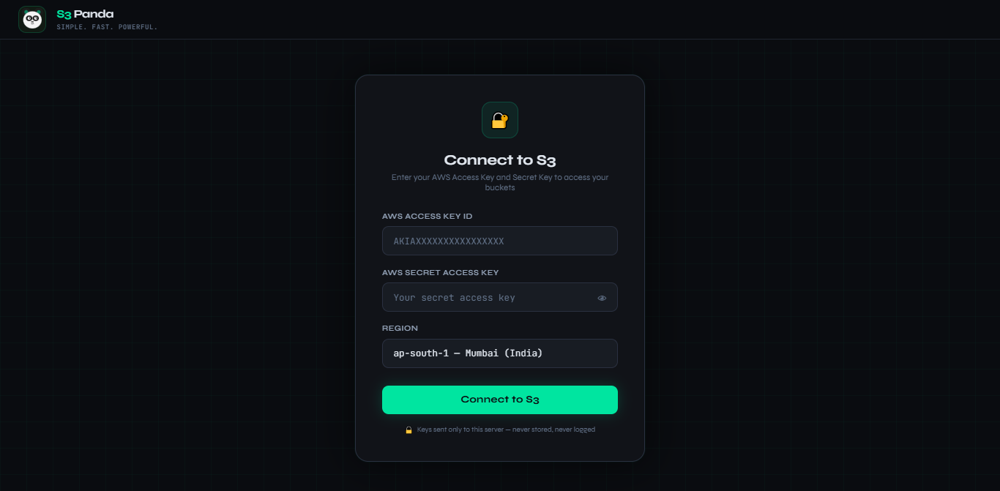

<div align="center">

   
# 🐼 S3 Panda

### *Simple. Fast. Powerful.*

**A self-hosted, open-source AWS S3 File Explorer built on Node.js.**  
Browse folders, search files, upload, download, and delete — all from your browser using your own AWS credentials. No third-party services. No credential storage. Runs entirely on your EC2 instance.

[](./LICENSE)
[](https://nodejs.org)
[](https://github.com/aws/aws-sdk-js-v3)
[](./CONTRIBUTING.md)




> **No hardcoded keys. No CSV uploads. No SaaS.**  
> S3 Panda runs on your EC2 instance. You supply your AWS Access Key and Secret Key directly in the browser — they are sent only to your own server and never stored anywhere.

</div>

## ❓ Why Use S3 Panda?

While many S3 management tools already exist in the market, most of them require:

* Local software installation on every end-user laptop
* AWS Console access for users
* Complex setup and configuration
* Technical knowledge to browse and manage S3 buckets

S3 Panda solves this by providing a lightweight, browser-based S3 dashboard that runs entirely on your own EC2 instance.

### ✅ Key Advantages

| Advantage                       | Description                                                                                   |
| ------------------------------- | --------------------------------------------------------------------------------------------- |
| 🌐 No local installation        | Users only need a browser — no desktop application or AWS CLI setup required                  |
| 🔐 No AWS Console access needed | End users can access only the required S3 buckets without exposing the AWS Management Console |
| 👥 Easy multi-user access       | Deploy once on EC2 and share access with multiple users using IAM policies                    |
| 🎯 User-friendly UI             | Simple dashboard designed for both technical and non-technical users                          |
| 🛡️ Controlled access            | You can create multiple restrict bucket permissions using IAM policies based on business requirements|
| 🚀 Self-hosted                  | Runs fully inside your AWS environment — no third-party SaaS dependency                       |
| 💰 Cost-effective               | One centralized deployment instead of installing tools for every user                         |

### 💡 Common Use Cases

* Sharing S3 access with clients or vendors
* Providing bucket access to non-technical teams
* Internal file sharing portal on top of S3
* Simplified S3 management for support/operations teams
* Secure alternative to sharing AWS Console access

---

## 👥 Who Should Use S3 Panda?

S3 Panda is designed for organizations and teams that want a simple and secure way to access AWS S3 buckets without exposing the AWS Console.

### Best suited for:

* 👨‍💼 End users who only need S3 file access
* 🧑‍💻 Non-technical users who prefer a simple dashboard
* 🏢 Organizations that do not want to share AWS Console access
* 📂 Teams managing uploads/downloads from S3 regularly
* 🔐 Companies requiring controlled bucket-level access using IAM policies
* ☁️ Businesses looking for a self-hosted S3 file explorer

### Perfect Example

Instead of:

* Installing multiple third-party S3 tools on user laptops
* Training non-technical users on AWS

You can:

* Deploy S3 Panda once on EC2
* Create limited IAM policies
* Share a simple web URL with users
* Let them securely access only the required S3 buckets


---
## 📋 Table of Contents

- [✨ Features](#-features)
- [🏗️ Architecture](#️-architecture)
- [🔐 IAM Setup — Step by Step](#-iam-setup--step-by-step)
- [🚀 Installation & Deployment](#-installation--deployment)
- [⚙️ Configuration](#️-configuration)
- [📁 Project Structure](#-project-structure)
- [🔌 API Reference](#-api-reference)
- [🛡️ Security](#️-security)
- [🤝 Contributing](#-contributing)
- [📄 License](#-license)

---

## ✨ Features

| Feature | Details |
|---|---|
| 🔐 **Credential-based login** | Enter AWS Access Key + Secret in browser — sent only to your EC2 server, never stored |
| 🪣 **Multi-bucket support** | Auto-lists all buckets accessible by your credentials |
| 📁 **Folder navigation** | Browse nested prefixes with breadcrumb trail and Up button |
| 🔍 **Full-bucket search** | Searches all objects across the entire bucket (up to 500 results) |
| ⬇️ **Secure downloads** | Pre-signed S3 URLs — valid for 10 minutes |
| ⬆️ **File upload** | Upload single or multiple files; drag-and-drop supported |
| 🗑️ **Delete** | Delete single files or bulk-delete with checkbox selection |
| 📊 **Stats bar** | Live folder/file count and total size |
| 🌍 **Multi-region** | 9 AWS regions selectable at login |
| 🎨 **Dark UI** | Syne + JetBrains Mono fonts, green accent, grid texture |
| 🐼 **Panda logo** | Custom SVG panda face — because why not |

---

## 🏗️ Architecture

```
┌──────────────────────────────────────────────────────────┐
│                    YOUR AWS ACCOUNT                      │
│                                                          │
│  ┌───────────────────────────────────────────────────┐   │
│  │                  EC2 Instance                     │   │
│  │                                                   │   │
│  │   ┌───────────────────────────────────────────┐   │   │
│  │   │        S3 Panda  (Node.js / Express)      │   │   │
│  │   │        Listening on  0.0.0.0:3000         │   │   │
│  │   │                                           │   │   │
│  │   │   Every API call receives ak + sk         │   │   │
│  │   │   from the browser and builds a           │   │   │
│  │   │   fresh S3Client({ credentials })         │   │   │
│  │   │   — no fallback to IAM Role or env vars   │   │   │
│  │   └───────────────────┬───────────────────────┘   │   │
│  │                       │  AWS SDK v3               │   │
│  │   ┌───────────────────▼───────────────────────┐   │   │
│  │   │   Credentials supplied by browser         │   │   │
│  │   │   (Access Key ID + Secret Access Key)     │   │   │
│  │   └───┬───────┬────────┬────────┬─────────────┘   │   │
│  └───────│───────│────────│────────│─────────────────┘   │
│          │       │        │        │                     │
│  ┌───────▼──┐ ┌──▼───┐ ┌──▼───┐ ┌──▼────────┐            │
│  │   List   │ │ Get  │ │ Put  │ │  Delete   │            │
│  │ Buckets  │ │Object│ │Object│ │  Object   │            │
│  │ListObjV2 │ │      │ │      │ │           │            │
│  └──────────┘ └──────┘ └──────┘ └───────────┘            │
│                                                          │
└──────────────────────────────────────────────────────────┘

     Your Browser ──HTTP──▶ EC2 :3000 ──AWS SDK──▶ S3 APIs
     (ak + sk in every request)        (your credentials)
```

### Request Flow

```
Browser: GET /api/list?bucket=my-bucket&prefix=images/&ak=AKIA...&sk=...
              │
              ▼
      guard() — ak/sk present? ──NO──▶ 401 Unauthorized
              │
             YES
              │
              ▼
      makeS3(ak, sk, region)   ← explicit credentials, no env fallback
              │
              ▼
      ListObjectsV2Command({ Bucket, Prefix, Delimiter: "/" })
              │
              ▼
      { folders: [...], files: [...] }  ──▶  Browser renders table
```

---

## 🔐 IAM Setup — Step by Step

S3 Panda needs an IAM user (or role) with S3 permissions. The included `s3panda-iam-policy.json` defines the minimum required actions.

### Step 1 — Create the IAM Policy

**Via AWS Console:**
1. Open **IAM → Policies → Create policy**
2. Click the **JSON** tab
3. Paste the contents of `s3panda-iam-policy.json`
4. Name it `S3PandaPolicy` → Create

**Via AWS CLI:**
```bash
aws iam create-policy \
  --policy-name S3PandaPolicy \
  --policy-document file://s3panda-iam-policy.json \
  --description "Minimum S3 permissions for S3 Panda"
```

The policy grants:

| AWS Service | Actions | Purpose |
|---|---|---|
| S3 | `ListAllMyBuckets` | List all buckets at login |
| S3 | `ListBucket` | Browse folders and search |
| S3 | `GetObject` | Download files (pre-signed URLs) |
| S3 | `PutObject` | Upload files |
| S3 | `DeleteObject` | Delete files |
| S3 | `GetBucketLocation` | Resolve bucket region |

### Step 2 — Create the IAM User

```bash
# Create user
aws iam create-user --user-name s3panda-user

# Attach policy (replace ACCOUNT_ID)
aws iam attach-user-policy \
  --user-name s3panda-user \
  --policy-arn arn:aws:iam::ACCOUNT_ID:policy/S3PandaPolicy

# Create access keys
aws iam create-access-key --user-name s3panda-user
# → copy AccessKeyId and SecretAccessKey
```

### Step 3 — Use Keys in S3 Panda

Open `http://YOUR_EC2_IP:3000` in your browser, enter the Access Key ID and Secret Access Key, select your region, and click **Connect to S3**.

---

## 🚀 Installation & Deployment

### Prerequisites

| Requirement | Minimum Version | Check |
|---|---|---|
| Node.js | 18 LTS | `node --version` |
| npm | 8 | `npm --version` |
| EC2 instance | Any size (t3.micro works) | — |
| OS | Ubuntu 20.04+ or Amazon Linux 2+ | — |

### Step 1 — Install Node.js on EC2

**Ubuntu / Debian:**
```bash
curl -fsSL https://deb.nodesource.com/setup_20.x | sudo -E bash -
sudo apt-get install -y nodejs
node --version   # v20.x.x
```

**Amazon Linux 2023:**
```bash
curl -o- https://raw.githubusercontent.com/nvm-sh/nvm/v0.39.7/install.sh | bash
source ~/.bashrc
nvm install 20 && nvm use 20
node --version
```

**Amazon Linux 2:**
```bash
curl -fsSL https://rpm.nodesource.com/setup_20.x | sudo bash -
sudo yum install -y nodejs
```

### Step 2 — Clone and Install

```bash
git clone https://github.com/krishnabagal/s3panda.git
cd s3panda
npm install
```

### Step 3 — Start S3 Panda

```bash
node server.js
```

Expected output:
```
✅  S3 Panda → http://0.0.0.0:3000
    Mode: browser-supplied credentials ONLY
    IAM roles / aws configure / env vars are IGNORED
```

Open in browser: **`http://YOUR_EC2_PUBLIC_IP:3000`**

### Step 4 — Open Port 3000 in Security Group

```bash
# Allow your IP only (recommended)
aws ec2 authorize-security-group-ingress \
  --group-id sg-xxxxxxxxxxxxxxxxx \
  --protocol tcp \
  --port 3000 \
  --cidr YOUR_IP_ADDRESS/32
```

> 🔒 Do **not** open port 3000 to `0.0.0.0/0`. Restrict to your IP or put an HTTPS ALB in front.

### Step 5 — Run as a Persistent Service

**Using PM2 (recommended):**
```bash
npm install -g pm2
pm2 start server.js --name s3panda
pm2 startup && pm2 save

# Useful commands
pm2 status
pm2 logs s3panda
pm2 restart s3panda
```

**Using systemd:**
```bash
sudo tee /etc/systemd/system/s3panda.service << 'EOF'
[Unit]
Description=S3 Panda File Explorer
After=network.target

[Service]
Type=simple
User=ubuntu
WorkingDirectory=/home/ubuntu/s3panda
ExecStart=/usr/bin/node server.js
Restart=on-failure
RestartSec=10
Environment=PORT=3000

[Install]
WantedBy=multi-user.target
EOF

sudo systemctl daemon-reload
sudo systemctl enable s3panda
sudo systemctl start s3panda
sudo systemctl status s3panda
```

### Optional — Run on Port 80 with Nginx

```bash
sudo apt install -y nginx   # Ubuntu
# or: sudo yum install -y nginx

sudo tee /etc/nginx/conf.d/s3panda.conf << 'EOF'
server {
    listen 80;
    server_name YOUR_EC2_IP;
    client_max_body_size 500M;

    location / {
        proxy_pass http://localhost:3000;
        proxy_http_version 1.1;
        proxy_set_header Upgrade $http_upgrade;
        proxy_set_header Connection 'upgrade';
        proxy_set_header Host $host;
        proxy_cache_bypass $http_upgrade;
    }
}
EOF

sudo nginx -t && sudo systemctl enable --now nginx
```

---

## ⚙️ Configuration

### Environment Variables

| Variable | Default | Description |
|---|---|---|
| `PORT` | `3000` | TCP port to bind |

```bash
PORT=8080 node server.js
```

### Upload Size Limit

Default is 500 MB. To change, edit `server.js`:
```js
const upload = multer({
  storage: multer.memoryStorage(),
  limits: { fileSize: 500 * 1024 * 1024 },  // ← change this
});
```

### Download URL Expiry

Pre-signed download URLs expire after 10 minutes. To change:
```js
// server.js — /api/download-url route
const url = await getSignedUrl(s3, command, { expiresIn: 600 }); // ← seconds
```

---

## 📁 Project Structure

```
s3panda/
├── server.js                 # Express server + all AWS S3 API calls
├── package.json              # Dependencies manifest
├── s3panda-iam-policy.json   # Minimum IAM policy (copy-paste ready)
├── LICENSE                   # MIT License
├── CONTRIBUTING.md           # Contribution guide
├── README.md                 # This file
│
└── public/
    └── index.html            # Complete single-page UI
                              # (all JS, CSS, and SVG panda logo inline)
```

### `server.js` Internal Structure

```
Imports   →  AWS SDK S3Client + 5 commands
             Express, multer, cors

Helpers   →  makeS3(ak, sk, region)    build S3 client from browser creds
             creds(req)                extract ak/sk from query or body
             friendlyError(err)        map AWS errors to readable messages
             guard(req, res)           reject if credentials missing

Routes    →  GET  /api/health          liveness check
             GET  /api/buckets         list all buckets (validates creds)
             GET  /api/list            list objects in a prefix
             GET  /api/search          full-bucket search (up to 500 results)
             GET  /api/download-url    generate pre-signed download URL
             POST /api/upload          upload file to bucket/prefix
             DELETE /api/delete        delete a single object
```

---

## 🔌 API Reference

All routes require `ak` (Access Key ID) and `sk` (Secret Access Key) — passed as query params for GET, or in the request body for POST/DELETE.

### `GET /api/health`

Liveness check. No credentials required.

```bash
curl http://localhost:3000/api/health
# → { "status": "ok" }
```

### `GET /api/buckets`

List all S3 buckets. Also validates credentials — returns 401 on bad keys.

```bash
curl "http://localhost:3000/api/buckets?ak=AKIA...&sk=...&region=ap-south-1"
# → { "buckets": ["my-bucket", "backup-2026"] }
```

### `GET /api/list`

List folders and files at a prefix (one level deep).

| Param | Required | Description |
|---|---|---|
| `ak` | ✅ | Access Key ID |
| `sk` | ✅ | Secret Access Key |
| `bucket` | ✅ | Bucket name |
| `prefix` | — | Folder prefix e.g. `images/` (default: root) |
| `region` | — | AWS region (default: `ap-south-1`) |

```bash
curl "http://localhost:3000/api/list?ak=AKIA...&sk=...&bucket=my-bucket&prefix=images/"
```

**Response:**
```json
{
  "folders": [
    { "type": "folder", "key": "images/photos/", "name": "photos", "size": null, "modified": null }
  ],
  "files": [
    { "type": "file", "key": "images/banner.jpg", "name": "banner.jpg", "size": 148000, "modified": "2026-04-10T08:15:00Z" }
  ],
  "truncated": false
}
```

### `GET /api/search`

Search all objects in a bucket by name substring (up to 500 results).

```bash
curl "http://localhost:3000/api/search?ak=AKIA...&sk=...&bucket=my-bucket&query=invoice"
# → { "results": [ { "type": "file", "key": "...", "name": "...", ... } ] }
```

### `GET /api/download-url`

Generate a pre-signed download URL (valid 10 minutes).

```bash
curl "http://localhost:3000/api/download-url?ak=AKIA...&sk=...&bucket=my-bucket&key=images/banner.jpg"
# → { "url": "https://my-bucket.s3.amazonaws.com/images/banner.jpg?X-Amz-Signature=..." }
```

### `POST /api/upload`

Upload a file. Send as `multipart/form-data`.

| Field | Description |
|---|---|
| `file` | The file to upload |
| `ak` | Access Key ID |
| `sk` | Secret Access Key |
| `bucket` | Destination bucket |
| `prefix` | Destination folder prefix (optional) |
| `region` | AWS region (optional) |

```bash
curl -X POST http://localhost:3000/api/upload \
  -F "file=@./report.pdf" \
  -F "ak=AKIA..." \
  -F "sk=..." \
  -F "bucket=my-bucket" \
  -F "prefix=reports/"
# → { "success": true, "key": "reports/report.pdf" }
```

### `DELETE /api/delete`

Delete a single object.

```bash
curl -X DELETE http://localhost:3000/api/delete \
  -H "Content-Type: application/json" \
  -d '{ "ak": "AKIA...", "sk": "...", "bucket": "my-bucket", "key": "images/banner.jpg" }'
# → { "success": true }
```

---

## 🛡️ Security

### What S3 Panda never does

| ❌ | Detail |
|---|---|
| Store credentials | Keys live in browser memory only — cleared on sign-out |
| Log credentials | `ak` and `sk` are never written to any log |
| Use environment credentials | `makeS3()` always passes explicit credentials — no IAM Role fallback |
| Send data externally | Runs entirely within your EC2 instance |
| Write credentials to disk | In-memory only; gone on page refresh or sign-out |

### Hardening checklist

```bash
# 1. Restrict Security Group — allow port 3000 from your IP only
aws ec2 authorize-security-group-ingress \
  --group-id sg-xxxxxxxxxxxxxxxxx \
  --protocol tcp --port 3000 \
  --cidr YOUR_IP/32

# 2. Follow least-privilege — use s3panda-iam-policy.json
#    Scope Resource to specific buckets if possible:
#    "Resource": ["arn:aws:s3:::my-bucket", "arn:aws:s3:::my-bucket/*"]

# 3. For production — put HTTPS ALB in front of port 3000
#    Use AWS Certificate Manager (ACM) for a free TLS certificate

# 4. Rotate IAM access keys regularly
aws iam create-access-key --user-name s3panda-user
aws iam delete-access-key --user-name s3panda-user --access-key-id OLD_KEY_ID
```

### Error handling

All AWS SDK errors are mapped to user-friendly messages and never expose raw stack traces to the browser. Credential failures return HTTP 401.

---

## 🤝 Contributing

```bash
git clone https://github.com/krishnabagal/s3panda.git
cd s3panda && npm install

git checkout -b feature/your-feature
# make changes
node server.js   # test locally

git add . && git commit -m "feat: describe your change"
git push origin feature/your-feature
# open Pull Request on GitHub
```

**Ideas for contributions:**

- [ ] Folder creation
- [ ] Rename / move files (copy + delete)
- [ ] File preview (images, text, PDF)
- [ ] Multi-file download as ZIP
- [ ] Presigned URL sharing with expiry picker
- [ ] Upload progress bar
- [ ] S3 bucket versioning support
- [ ] Dark / light theme toggle
- [ ] Mobile-responsive layout
- [ ] Session persistence (optional localStorage)

See [CONTRIBUTING.md](./CONTRIBUTING.md) for full guidelines.

---

## 📄 License

MIT © 2026 S3 Panda Contributors — see [LICENSE](./LICENSE) for full text.

### Third-party open-source licenses

| Package | License |
|---|---|
| [Express.js](https://expressjs.com) | MIT |
| [AWS SDK for JavaScript v3](https://github.com/aws/aws-sdk-js-v3) | Apache-2.0 |
| [Multer](https://github.com/expressjs/multer) | MIT |
| [Syne](https://fonts.google.com/specimen/Syne) | SIL OFL 1.1 |
| [JetBrains Mono](https://fonts.google.com/specimen/JetBrains+Mono) | SIL OFL 1.1 |

---
<div align="center">
     
**Built with ❤️ for the AWS community**

⭐ Star this repo if S3 Panda made your S3 workflow easier!

[🐛 Report Bug](https://github.com/krishnabagal/s3panda/issues) · [💡 Request Feature](https://github.com/krishnabagal/s3panda/issues) · [💬 Discussions](https://github.com/krishnabagal/s3panda/discussions)

</div>
